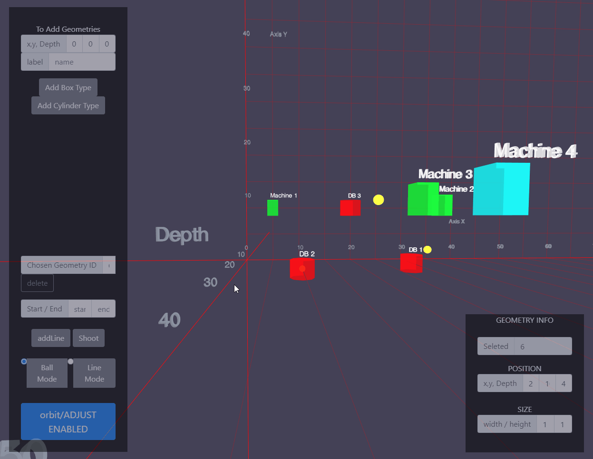
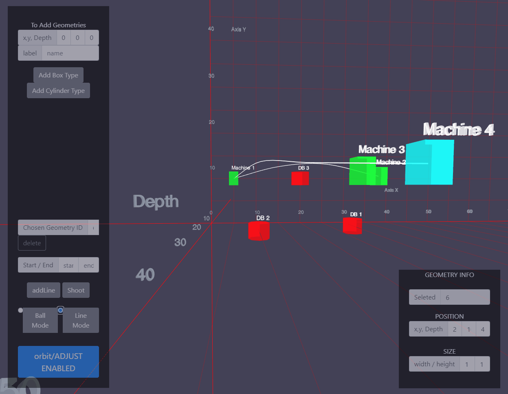

# 00.Three.js MiniProject 다짜고짜 보고가기

## 1. Three.js?

webgl을 쉽게 사용할 수 있게 해주는 대표적인 소스 중에 하나로, 상대적으로 기능과 구현이 복잡하고 제한적인 기본형보다 자유롭고 다양한 제작이 가능하다.

이번 미니프로젝트에서는 각 도형들을 위치로 포지셔닝 할 수 있고, 이 도형들을 시스템이나 머신 혹은 데이터베이스라 가정해 이 사이의 데이터 이동을 시각화한 프로젝트이다.

XYZ를 그냥 곧이곧대로 사용하는 것보다, XY 평면에 depth 개념을 적용하는 것이 직관적인 이해에 더 도움이 될 것이라 생각했고,

이 데이터 이동을 \[선의 굵기와 색 변화 / 공의 이동\]의 두가지로 표현해보았다.

## 2. Link

레포 - [링크](https://github.com/ArkimCity/three.js_practice)

실제 구동 사이트\(데이터는 예시로 임의 생성중\) - [링크](https://arkimcity.github.io/three.js_practice/)

